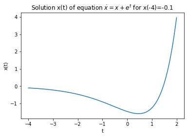
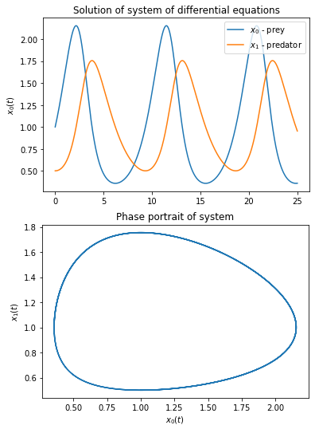

<html>
  <head>
    <meta name="google-site-verification" content="SZ1PDilxZZ25B_97z9crWOqkiTIT5MVL_vDlkV0Adfs" />
  </head>
</html>

*GitHub does not support LaTeX inlines formulas. To correctly display the contents of the README file, it is recommended to use a light theme.*

<!-- PROJECT -->
<br />
<p align="center">
  <h3 align="center">ODE's solving with odepy</h3>
</p>

`odepy` is a module for numerical solving of ordinary differential equations and systems of equations of the order  in explicit form.
<br/><br/>

<!-- TABLE OF CONTENTS -->
<details open="open">
  <summary>Table of Contents:</summary>
  <ol>
    <li><a href="#About">About</a></li>
    <li><a href="#Installation">Installation</a></li>
    <li><a href="#Examples">Examples</a></li>
      <ul>
          <li><a href="#Example1">Introduction</a></li>
          <li><a href="#Example2">Example: Lotka–Volterra equations</a></li>
          <li><a href="#Example3">System of differential equations</a></li>
      </ul>
  </ol>
</details>


## About

The aim of this project was to create a tool enabling the easiest way and with minimal involvement of the user, to solve systems of ordinary differential equations.
This package contains implementations of the most popular numerical methods used to solve ODE's such as: Euler, Runge-Kutta method, Heun scheme.

**NOTE: The module is still in its early stages of development. Thank you for any comments!**

## Installation

### With pip + git
1. Use pip to install module from github
```sh
pip install -e git+https://github.com/msoczi/odepy#egg=odepy
```
2. Run python and import module:
```python
import odepy
```

### Just download the file
1. Download file: <a href="/src/odepy/ODE_solver.py">ODE_solver.py</a>.
2. Run python and add module to syspath:
```python
import sys
sys.path.append('/.../directory_to_module/')

import ODE_solver
```
3. You can use 'odepy' :)


## Examples

### Example1

Let's consider a simple first-order differential equation with dependent variable .


How to solve them with odepy?
First, we need to properly define our equation, i.e. write it in a form that depends on the derivative function.
```python
import math

def simple_equation(t, *x):
    # x' = x + e^t
    return (x[0] + math.exp(t), )
```
Note that the tuple returned by the function has a comma (this is because the implementation allows you to solve equations of any order , then the tuple will consist of  elements, for more refer to <a href="#Example3">Example3</a> ). <br>
The notation `*x` allows you to specify any number of arguments of the function, that is, any number of variables in the equation. Variables of the equation are defined as subsequent elements of the argument list `x` and we refer to them by the index, e.g. `x[0], x[1], ...`. <br>
The next step is to define a *solver* that will solve the previously defined equation. For example:
```python
solver = odepy.ODE_solver(simple_equation, 10000, 2, -4, -0.1)
```
The arguments of which are accordingly `(equation, N, T, t0, *args)`, where: <br>
1. `equation [function]` - is the function defining the equation to be solved,
2. `N [int]` - is an integer specifying the number of points at which the equation is calculated. Generally, the greater the number, the more accurate the solution,
3. `T [float]` - the upper boundary of the interval  on which we solve the equation
4. `t0 [float]` - the lower boundary of the interval  on which we solve the equation
5. `*args [float]` - a set of initial conditions for dependent variables in the order . Depending on the order of the equation, an appropriate number of initial conditions should be given. For example, for an equation of order 2, two numbers should be given ,x_1(t_0)).

So, the *solver* defined above will solve the equation  on the interval [-4,2] with mesh density N=10000 and the initial condition x(-4)=-0.1.<br>
Once we have defined the *solver*, we can start solving the equation.
```python
solver.solve()
```
The default scheme used by `solve()` is the classical 4th order Runge-Kutta scheme. Other methods are also available. To use them, just specify the appropriate value in the `methods` argument. E.g.
```python
solver.solve(method='euler')
```
Available methods:
* `rk4` - 4th Order Runge-Kutta scheme
* `rk2` - 2nd Order Runge-Kutta scheme
* `heun` - Heun scheme
* `euler` - Euler scheme (1st Order Runge-Kutta scheme)

The solution of the equation is stored in the attributes of the `ODE_solver` class. Each of the dimensions, i.e. , is stored in a separate attribute with just such a name. We can refer to them through:
```python
solver.t_values
solver.x0_values
solver.x1_values
solver.x2_values
...
```

The solution of the equation can be drawn using the matplotlib module:
```python
plt.plot(solver.t_values, solver.x0_values)
plt.xlabel('t')
plt.ylabel('x(t)')
plt.title('Solution of equation $\dot{x}=x+e^t$ for x(-4)=-0.1')
plt.show()
```



<br>

### Example2
Below is an example of using `odepy` for a system of equations <br>
 <br>
 <br>
With parameters `r=1, a=1, s=0.5, b=0.5`, and the initial conditions `x_0(0)=1,x_1(0)=0.5` on the interval `[0, 25]`.

```python

# Equation parameters definition
r=1
a=1
s=0.5
b=0.5

# Definition of equation
def equ_fun(t, *x):
    # x' = r*x - a*x*y
    # y' = -s*y + a*b*x*y
    return (
        r*x[0]-a*x[0]*x[1],
        -s*x[1]+a*b*x[0]*x[1]
    )

# Defining 'solver' on interval [0, 25] with N=10000
# Initial conditions: x0(0)=1 and x1(0)=0.5
euler_solver = odepy.ODE_solver(equ_fun, 10000, 25, 0, 1, 0.5)

# Solving equation using explicit Euler method ('euler')
euler_solver.solve(method = 'euler')

# Now we can draw the solutions and phase portrait
import matplotlib.pyplot as plt
plt.plot(euler_solver.t_values, euler_solver.x0_values, label='$x_0$ - prey')
plt.plot(euler_solver.t_values, euler_solver.x1_values, label='$x_1$ - predator')
plt.legend()
plt.title('Solution of system of differential equations')
plt.xlabel('t')
plt.ylabel('$x_0(t)$')
plt.show()

plt.plot(euler_solver.x0_values, euler_solver.x1_values)
plt.title('Phase portrait of system')
plt.xlabel('$x_0(t)$')
plt.ylabel('$x_1(t)$')
plt.show()
```




### Example3
### Systems of equations of the order $n$

**DEFINITION**<br>
_An ordinary differential equation of the order  is an equation of the form:<br>
})=0)
<br>
In this equation,  is the independent variable and  is the dependent variable._ <br>
Let  satisfy the assumptions of the implicit function theorem locally with respect to 
}), then this equation can be written in the following form
<br>
}(t)=f(t,x,\dot{x},\ddot{x},...,x^{(n-1)}))
<br>
On the other hand, the -th order equation in the explicit form can be easily reduced to the  systems of first order equation. To do this, use a substitution =x^{(i-1)}(t)) for  i.e.:
<br>
=x(t),x_1(t)=\dot{x}(t),x_2(t)=\ddot{x}(t),...,x_{n-1}(t)=x^{(n-1)}(t))
<br>
Then if
<br>

<br>
equation of -th order }(t)=f(t,x,\dot{x},\ddot{x},...,x^{(n-1)})) can be written as:
<br>
)
<br>
where ) is a vector
<br>

<br>

#### Simple example:
Convert the 3rd order equation
<br>
}=2\ddot{x}-5\dot{x}%2Bx)
<br>
into a system of 3 first order equations.
Let
<br>

<br>
then
<br>

<br>
Finally we get a system of equations:
<br>
<br>
<br>
<br>
<br>
The above system of equations can be already defined in the `odepy` module.
```python
def equation(t, *x):
    return (
        x[1],
        x[2],
        2*x[2]-5*x[1]+x[0]
    )
```


_For more examples, please refer to this [page](/exmpl_img/examples.md)._

## Contact

Mateusz Soczewka - msoczewkas@gmail.com <br>
<br>
Thank you for any comments. :smiley:

## Bibliography
* [1] _Równania różniczkowe zwyczajne: teoria i metody numeryczne z wykorzystaniem komputerowego systemu obliczeń symbolicznych_, Andrzej Palczewski, 2004, WNT
* [2] _Nonlinear Ordinary Differential Equations: An Introduction for Scientists and Engineers_, Dominic Jordan, Peter Smith
* [3] http://mst.mimuw.edu.pl/lecture.php?lecture=nrr
* [4] http://www.deltami.edu.pl/temat/matematyka/zastosowania/2014/08/02/O_pewnym_ciekawym_zastosowaniu_m/
