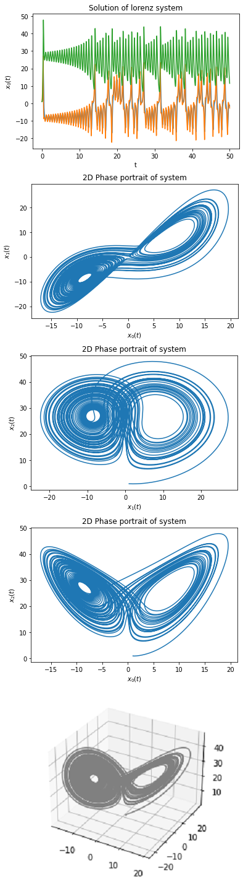

<!-- TABLE OF CONTENTS -->
<details open="open">
  <summary>More examples:</summary>
  <ol>
    <li><a href="#Example1">Duffing oscilator</a></li>
    <li><a href="#Example2">Lorenz system</a></li>
  </ol>
</details>

## Example1
The Duffing equation (or Duffing oscillator) is a non-linear second-order differential equation used to model certain damped and driven oscillators.
The general formula is given by
<br>

<br>
For specific parameters, it could be written as system of two equations
<br>

<br>
)
<br>
The Duffing equation is an example of a dynamical system that exhibits chaotic behavior.

```python
import odepy
import math
import matplotlib.pyplot as plt

# Definition of equation
def duffing(t, *x):
    return (
        x[1],
        -0.1*x[1]-1*x[0]-5*x[0]**3+8*math.cos(0.5*t)
    )

# Defining 'solver' on interval [0, 100] with N=10000
# Initial conditions: x0(0)=1 and x1(0)=0
rk_solver = odepy.ODE_solver(duffing, 10000, 100, 0, 1, 0)

# Solving equation using explicit RK2
rk_solver.solve(method = 'rk2')

# Now we can draw the solutions
plt.plot(rk_solver.t_values, rk_solver.x0_values)
plt.title('Solution of duffing equation')
plt.xlabel('t')
plt.ylabel('$x_0(t)$')
plt.show()
# And phase portrait
plt.plot(rk_solver.x0_values, rk_solver.x1_values)
plt.title('Phase portrait of system')
plt.xlabel('$x_0(t)$')
plt.ylabel('$x_1(t)$')
plt.show()
```
<figure><figcaption>image caption</figcaption></figure>


## Example2
In 1963, Edward Lorenz, with the help of Ellen Fetter, developed a simplified mathematical model for atmospheric convection.
The model is a system of 3 ordinary differential equations known as the Lorenz equations:
<br>

<br>
The equations relate the properties of a two-dimensional fluid layer uniformly warmed from below and cooled from above.
In particular, the equations describe the rate of change of three quantities with respect to time:
 is proportional to the rate of convection,
 to the horizontal temperature variation, and
 to the vertical temperature variation.
The constants  ,  , and  are system parameters proportional to the Prandtl number, Rayleigh number, and certain physical dimensions of the layer itself.<br>
More info on <a href="https://en.wikipedia.org/wiki/Lorenz_system">wiki</a>.
<br>
```python
import odepy
import math
import matplotlib.pyplot as plt
from mpl_toolkits import mplot3d # for 3D-plot

# Definition of equation
def lorenz(t, *x):
    return (
        10*(x[1] - x[0]),
        x[0] * (28 - x[2]) - x[1],
        x[0] * x[1] - 8/3 * x[2]
    )

# Defining 'solver' on interval [0, 50] with N=30000
# Initial conditions: x0(0)=1 and x1(0)=1, x2(0)=1
heun_solver = odepy.ODE_solver(lorenz, 30000, 50, 0, 1, 1, 1)

# Solving equation using explicit RK2
heun_solver.solve(method = 'heun')


# Now we can draw the solutions
plt.plot(heun_solver.t_values, heun_solver.x0_values)
plt.plot(heun_solver.t_values, heun_solver.x1_values)
plt.plot(heun_solver.t_values, heun_solver.x2_values)
plt.title('Solution of lorenz system')
plt.xlabel('t')
plt.ylabel('$x_0(t)$')
plt.show()
# And phase portrait
plt.plot(heun_solver.x0_values, heun_solver.x1_values)
plt.title('2D Phase portrait of system')
plt.xlabel('$x_0(t)$')
plt.ylabel('$x_1(t)$')
plt.show()
plt.plot(heun_solver.x1_values, heun_solver.x2_values)
plt.title('2D Phase portrait of system')
plt.xlabel('$x_1(t)$')
plt.ylabel('$x_2(t)$')
plt.show()
plt.plot(heun_solver.x0_values, heun_solver.x2_values)
plt.title('2D Phase portrait of system')
plt.xlabel('$x_0(t)$')
plt.ylabel('$x_2(t)$')
plt.show()

# Phase portrait
ax = plt.axes(projection='3d')
ax.plot3D(heun_solver.x0_values, heun_solver.x1_values, heun_solver.x2_values, 'gray')
plt.show()
```

<figure><figcaption>image caption</figcaption></figure>


